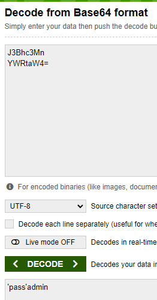
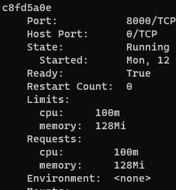

# Secrets

### kubectl
```shell
> kubectl create secret generic moscowtime-pass --from-literal=username=admin --from-literal=password='pass'
secret/moscowtime-pass created
```
```shell
> kubectl describe secret moscowtime-pass
Name:         moscowtime-pass
Namespace:    default
Labels:       <none>
Annotations:  <none>

Type:  Opaque

Data
====
password:  6 bytes
username:  5 bytes
```
Verification and decoding (via browser, sorry):
```shell
> kubectl get secret moscowtime-pass -o jsonpath='{.data}'
'{"password":"J3Bhc3Mn","username":"YWRtaW4="}'
```


### helm
I created gpg keys and encrypted secret:
```shell
> gpg --gen-key
pub   rsa3072 2022-12-12 [SC] [expires: 2024-12-11]
      D1B4AB150CCF7EE20BF2440FE75289FEF13CD008
uid                      IvanO <ivan-obraztsov@ya.ru>
sub   rsa3072 2022-12-12 [E] [expires: 2024-12-11]
> sops --encrypt --pgp D1B4AB150CCF7EE20BF2440FE75289FEF13CD008 test.yml
```
Installed it and checked:
```shell
> helm secrets install moscowtime ./moscowtime -n default -f ./moscowtime/data.yml
> kubectl get secret moscowtime-secret2 -o yaml
apiVersion: v1
data:
  password: U29tZVNlY3JldA==
kind: Secret
...
```

### resources
I checked resources:
```shell
> kubectl get pods
NAME                          READY   STATUS    RESTARTS   AGE
moscowtime-6b54d68c67-hq5h7   1/1     Running   0          46s
```
```shell
> kubectl describe pod moscowtime-6b54d68c67-hq5h7
Limits:
  cpu:     100m
  memory:  128Mi
Requests:
  cpu:        100m
  memory:     128Mi
```
