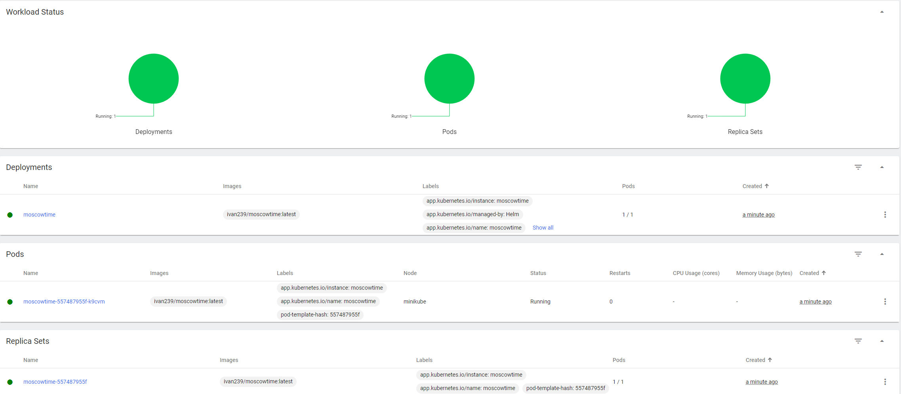

# k8s
At first, I created deployment and expose it:
```shell
> kubectl create deployment first-node --image=ivan239/moscowtime:latest
deployment.apps/first-node created
```
```shell
> kubectl expose deployment first-node --type=LoadBalancer --port=8000
service/first-node exposed
```

Then I start tunneling and service:
```shell
> minikube tunnel
✅  Tunnel successfully started

📌  NOTE: Please do not close this terminal as this process must stay alive for the tunnel to be accessible ...

🏃  Starting tunnel for service first-node.
```

```shell
> minikube service first-node
|-----------|------------|-------------|---------------------------|
| NAMESPACE |    NAME    | TARGET PORT |            URL            |
|-----------|------------|-------------|---------------------------|
| default   | first-node |        8000 | http://192.168.49.2:32350 |
|-----------|------------|-------------|---------------------------|
🏃  Starting tunnel for service first-node.
|-----------|------------|-------------|------------------------|
| NAMESPACE |    NAME    | TARGET PORT |          URL           |
|-----------|------------|-------------|------------------------|
| default   | first-node |             | http://127.0.0.1:50966 |
|-----------|------------|-------------|------------------------|
🎉  Opening service default/first-node in default browser...
❗  Because you are using a Docker driver on windows, the terminal needs to be open to run it.
```

After that we can see our pods and service:
```shell
> kubectl get pods,svc
NAME                              READY   STATUS    RESTARTS   AGE
pod/first-node-7ccfd7556b-xrcdc   1/1     Running   0          2m48s

NAME                 TYPE           CLUSTER-IP       EXTERNAL-IP   PORT(S)          AGE
service/first-node   LoadBalancer   10.105.153.245   127.0.0.1     8000:32350/TCP   2m9s
service/kubernetes   ClusterIP      10.96.0.1        <none>        443/TCP          3m59s
```

Then I cleaned up and added configs for easier deployment:
```shell
> kubectl delete service first-node
service "first-node" deleted
```
```shell
> kubectl delete deployment first-node
deployment.apps "first-node" deleted
```
```shell
> kubectl apply -f ./deployment.yml
deployment.apps/moscowtime-deployment created
```
```shell
> kubectl apply -f ./service.yml
service/moscowtime-service created
```

Then I start services:
```shell
> minikube service --all
|-----------|------------|-------------|--------------|
| NAMESPACE |    NAME    | TARGET PORT |     URL      |
|-----------|------------|-------------|--------------|
| default   | kubernetes |             | No node port |
|-----------|------------|-------------|--------------|
😿  service default/kubernetes has no node port
|-----------|--------------------|-------------|---------------------------|
| NAMESPACE |        NAME        | TARGET PORT |            URL            |
|-----------|--------------------|-------------|---------------------------|
| default   | moscowtime-service |        8000 | http://192.168.49.2:32766 |
|-----------|--------------------|-------------|---------------------------|
🏃  Starting tunnel for service kubernetes.
🏃  Starting tunnel for service moscowtime-service.
|-----------|--------------------|-------------|------------------------|
| NAMESPACE |        NAME        | TARGET PORT |          URL           |
|-----------|--------------------|-------------|------------------------|
| default   | kubernetes         |             | http://127.0.0.1:51040 |
| default   | moscowtime-service |             | http://127.0.0.1:51042 |
|-----------|--------------------|-------------|------------------------|
```

Finally, here is the list of pods,svc:
```shell
> kubectl get pods,svc
NAME                                         READY   STATUS    RESTARTS   AGE
pod/moscowtime-deployment-5fd9b64ffc-749qk   1/1     Running   0          113s
pod/moscowtime-deployment-5fd9b64ffc-7hnsc   1/1     Running   0          113s
pod/moscowtime-deployment-5fd9b64ffc-f82qr   1/1     Running   0          113s

NAME                         TYPE           CLUSTER-IP       EXTERNAL-IP   PORT(S)          AGE
service/kubernetes           ClusterIP      10.96.0.1        <none>        443/TCP          10m
service/moscowtime-service   LoadBalancer   10.105.111.190   <pending>     8000:32766/TCP   102s
```

# Helm
First, I created templates:
```shell
> helm create moscowtime
Creating moscowtime
```
Then I edited values.yaml to replace repository:
```yaml
image:
  repository: ivan239/moscowtime
  pullPolicy: IfNotPresent
  # Overrides the image tag whose default is the chart appVersion.
  tag: "latest"
service:
  type: NodePort
  container_port: 8000
  out_port: 8000
```
Also changed ports in deployment.yaml and service.yaml:
```yaml
ports:
  - containerPort: { { .Values.service.container_port } }
```
```yaml
ports:
  - port: { { .Values.service.out_port } }
    targetPort: { { .Values.service.container_port } }
```
Finally, I packaged and installed:
```shell
> helm package moscowtime && helm install moscowtime moscowtime-0.1.0.tgz
Successfully packaged chart and saved it to: C:\Users\oibek\PycharmProjects\devops-labs\k8s\moscowtime-0.1.0.tgz
NAME: moscowtime
LAST DEPLOYED: Mon Dec 12 09:41:52 2022
NAMESPACE: default
STATUS: deployed
REVISION: 1
NOTES:
1. Get the application URL by running these commands:
  export NODE_PORT=$(kubectl get --namespace default -o jsonpath="{.spec.ports[0].nodePort}" services moscowtime)
  export NODE_IP=$(kubectl get nodes --namespace default -o jsonpath="{.items[0].status.addresses[0].address}")
  echo http://$NODE_IP:$NODE_PORT
```
After that, I can check it worked:
```shell
> minikube service moscowtime
|-----------|------------|-------------|---------------------------|
| NAMESPACE |    NAME    | TARGET PORT |            URL            |
|-----------|------------|-------------|---------------------------|
| default   | moscowtime | http/8000   | http://192.168.49.2:30317 |
|-----------|------------|-------------|---------------------------|
🏃  Starting tunnel for service moscowtime.
|-----------|------------|-------------|------------------------|
| NAMESPACE |    NAME    | TARGET PORT |          URL           |
|-----------|------------|-------------|------------------------|
| default   | moscowtime |             | http://127.0.0.1:51449 |
|-----------|------------|-------------|------------------------|
```
```shell
> kubectl get pods,svc
NAME                              READY   STATUS    RESTARTS   AGE
pod/moscowtime-557487955f-k9cvm   1/1     Running   0          21s

NAME                 TYPE        CLUSTER-IP     EXTERNAL-IP   PORT(S)          AGE
service/kubernetes   ClusterIP   10.96.0.1      <none>        443/TCP          9h
service/moscowtime   NodePort    10.97.37.144   <none>        8000:32412/TCP   21s
```
