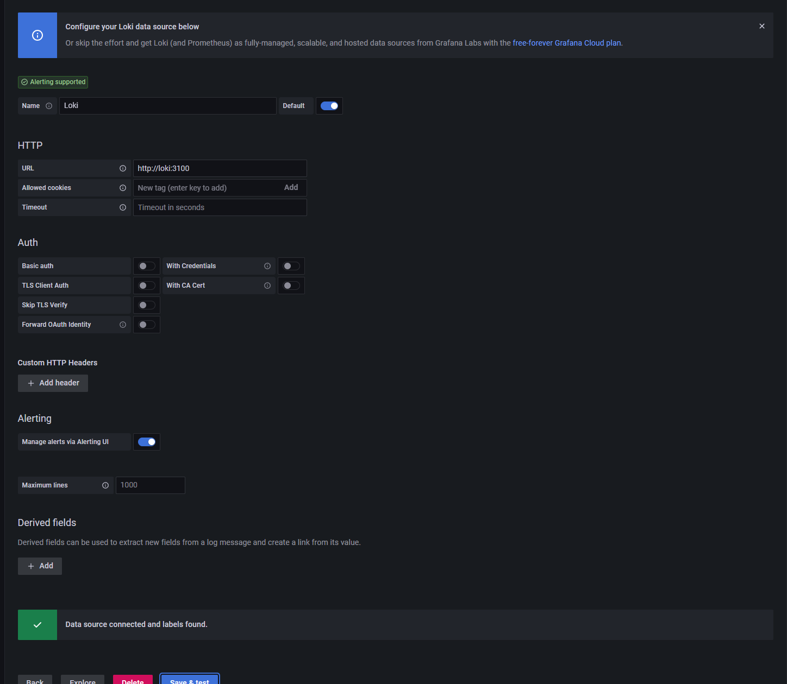
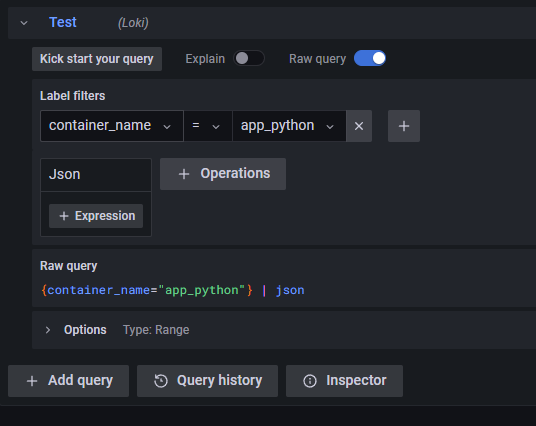
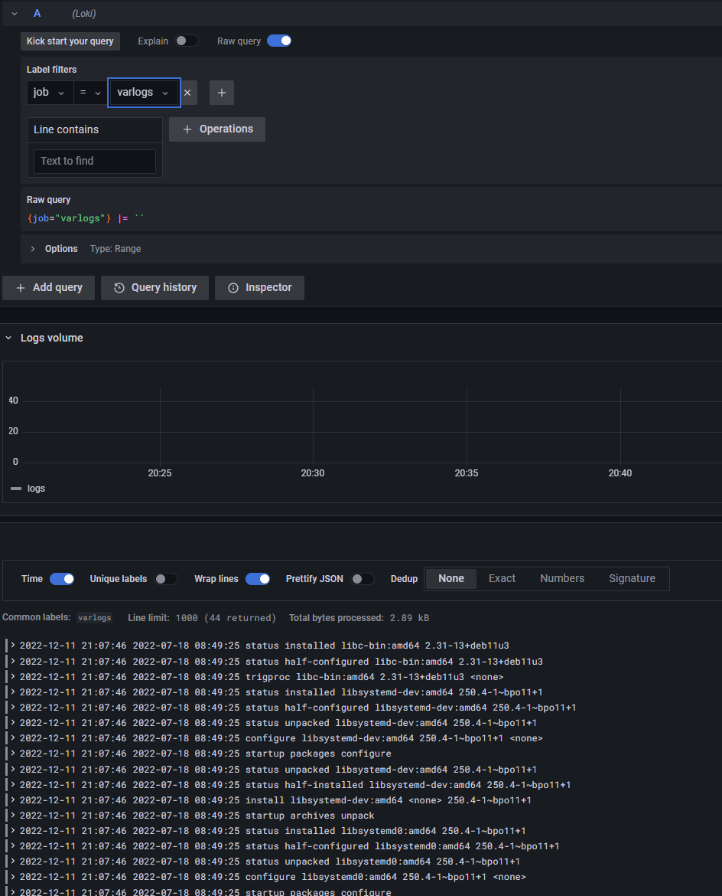

I started Promtail a little after Loki to let logs reach it.

Then after adding the following query we are able to see logs

Unfortunately, my app doesn't emit logs, but the configuration works, right? Hope it's enough for C)
But if you want here is the sample logs:

